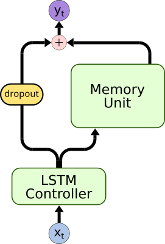
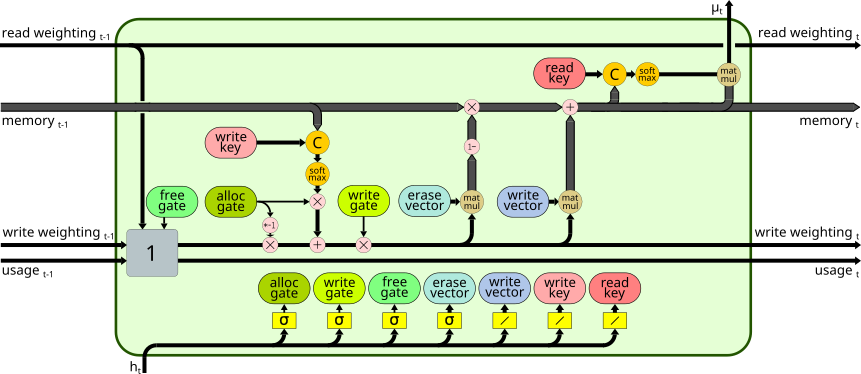
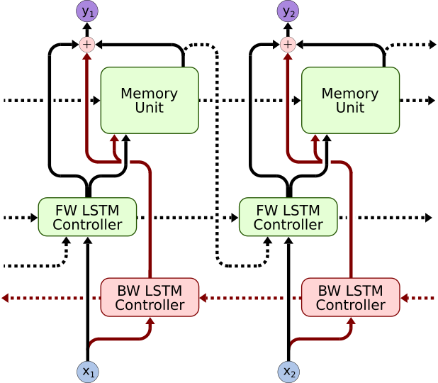
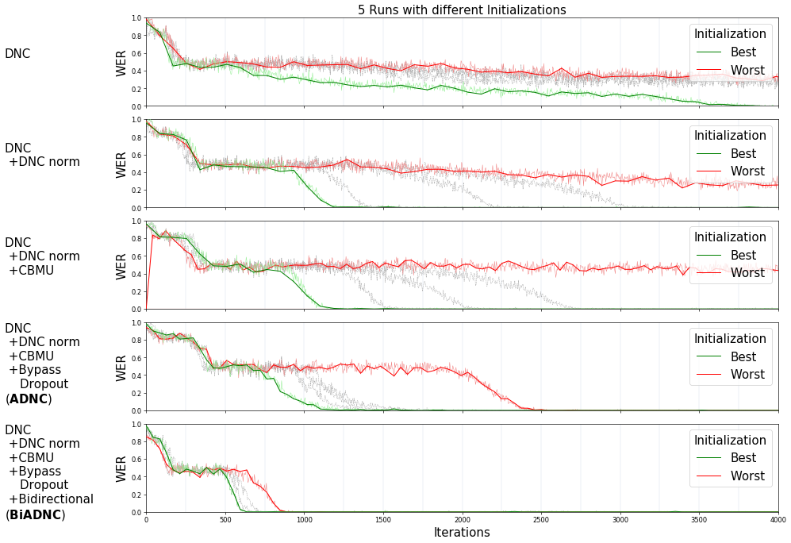
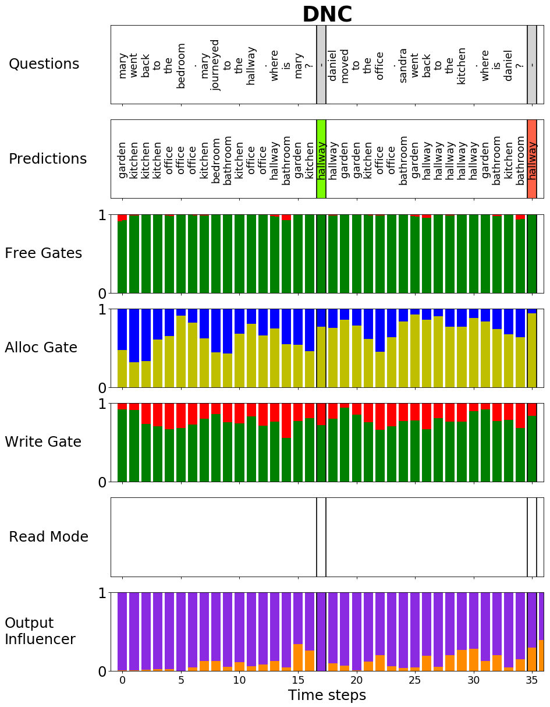
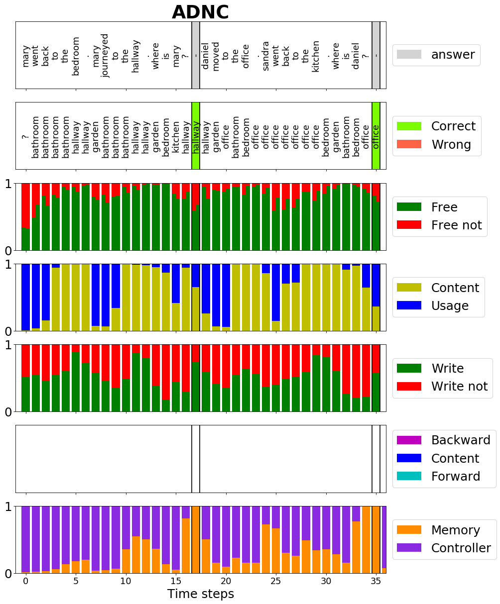

# Advanced Differentiable Neural Computer

[](https://travis-ci.org/joergfranke/ADNC)
[](https://www.python.org/downloads/release/python-365/)
[](https://www.tensorflow.org/)


This repository contains a implementation of a Advanced Differentiable Neural Computer (ADNC) for a more robust and 
scalable usage in Question Answering. This work is published on the [MRQA workshop](https://mrqa2018.github.io/) at the [ACL 2018](https://acl2018.org/). The ADNC is applied to the
[20 bAbI QA tasks](https://research.fb.com/downloads/babi/) with [SOTA mean results](#babi-results) and to the 
[CNN Reading Comprehension Task](https://github.com/danqi/rc-cnn-dailymail) with
[passable results](#cnn-results) without any adaptation or hyper-parameter tuning.

The repository contains the following features:

- Modular implementation of controller and memory unit
- Fully configurable model/experiment with a yaml-config-file 
- Unit tests for all key parts (memory unit, controller, etc. )
- Pre-trained models on bAbI task and CNN RC task
- Plots of the memory unit functionality during sequence inference
- The following advancements to the DNC:


<table>
    <tbody>
      <tr>
        <td align="center"></td>
        <td align="center"></td>
        <td align="center"></td>
        <td align="center"></td>
      </tr>
      <tr>
        <td align="center"><b>Bypass Dropout   </b></td>
        <td align="center"><b>DNC Normalization</b></td>
        <td align="center"><b>Content Based Memory Unit</b></td>
        <td align="center"><b>Bidirectional Controller</b></td>
      </tr>
      <tr>
        <td>
            <ul>
            <li>Dropout to reduce the bypass connectivity</li>
            <li>Forces an earlier memory usage during training</li>
            </ul>
        </td>
        <td>
            <ul>
            <li>Normalizes the memory unit's input</li>
            <li>Increases the model stability during training</li>
            </ul>
        </td>
        <td>
            <ul>
            <li>Memory Unit without temporal linkage mechanism</li>
            <li>Reduces memory consumption by up to 70</li>
            </ul>
        </td>
        <td>
            <ul>
            <li>Bidirectional DNC Architecture</li>
            <li>Allows to handle variable requests and rich information extraction</li>
            </ul> 
        </td>
      </tr>
    </tbody>
</table>

Please find detailed information about the advancements and the experiments in 

- MRQA 2018 paper submission [Robust and Scalable Differentiable Neural Computer for Question Answering](https://arxiv.org/abs/1807.02658)
- My master thesis about the [Advanced DNC for Question Answering](http://isl.anthropomatik.kit.edu/cmu-kit/downloads/Master_Franke_2018.pdf) with a detailed DNC/ADNC description.  

The plot below shows the impact of the different advancements in the word error rate with the bAbI task 1.

|  |
|----|


Furthermore, it contains a set of rich analysis tools to get a deeper insight in the functionality of the ADNC. For example
that the advancements lead to a more meaningful gate usage of the memory cell as you can see in the following plots:


|  |  |
|---|---|


## How to use:

### Setup ADNC (on Ubuntu)

To setup an virtual environment and install ADNC:
```
git clone https://github.com/joergfranke/ADNC.git
cd ADNC/
python3 -m venv venv
source venv/bin/activate
pip install -e .
```

### Inference

The repository contains different pre-trained models in the experiments folder.
For __bAbI inference__, choose pre-trained model e.g. `adnc` and run:

`python scripts/inference_babi_task.py adnc`

Possible models are `dnc`, `adnc`, `biadnc` on bAbi Task 1 and `biadnc-all`, `biadnc-aug16-all` for all bAbI tasks with or without augmentation of task 16. The augmentation provides equal word distribution during training.  

For __CNN inference__ of pre-trained ADNC run:

`python scripts/inference_babi_task.py`


### Training

The configuration file `scripts/config.yml` contains the full config of the ADNC training. The training script can be run with:

`python scripts/start_training.py`

It starts a bAbI training and plots every epoch a function plot to control the training progress. 

### Plots

To plot a function plot of the bAbI task choose pre-trained model e.g. `adnc` and run:

`python scripts/plot_function_babi_task.py`
					
Possible models are `dnc`, `adnc`, `biadnc` on bAbi Task 1 and `biadnc-all`, `biadnc-aug16-all` for all bAbI tasks with or without augmentation of task 16.


## Experiments & Results 

### 20 bAbI QA task 

- Joint trained on all 20 tasks.
- Mean results of 5 training runs with different initializations.
- Similar hyper-parameter as the [original DNC](https://www.nature.com/articles/nature20101)
- The unidirectional controller has one LSTM layer and 256 hidden units and the bidirectional has 172 hidden units in each direction. 
- The memory unit has 192 locations, a width of 64 and 4 read heads. 
- Bypass Dropout is applied with a dropout rate of 10\%. 
- The model is optimized with RMSprop with fixed learning rate of 3e-05 and momentum of 0.9.
- Task 16 Augmentation: The task contains a strong local minimum. Given the most common color as answer leads to a correct answer in 50\% of the cases.

#### bAbI Results

| Task                             | DNC             | EntNet                 | SDNC                   | ADNC                  | BiADNC                 | BiADNC<br>+aug16|
|----------------------------------|-----------------|------------------------|------------------------|------------------------|------------------------|--------------------------------------------------------|
| 1: 1 supporting fact             | 9.0 ± 12.6  | 0.0 ± 0.1          | 0.0 ± 0.0 | 0.1 ± 0.0          | 0.1 ± 0.1          | 0.1 ± 0.0                                          |
| 2: 2 supporting facts            | 39.2 ± 20.5 | 15.3 ± 15.7        | 7.1 ± 14.6         | 0.8 ± 0.5          | 0.8 ± 0.2          | 0.5 ± 0.2                                 |
| 3: 3 supporting facts            | 39.6 ± 16.4 | 29.3 ± 26.3        | 9.4 ± 16.7         | 6.5 ± 4.6          | 2.4 ± 0.6          | 1.6 ± 0.8                                 |
| 4: 2 argument relations          | 0.4 ± 0.7   | 0.1 ± 0.1          | 0.1 ± 0.1          | 0.0 ± 0.0          | 0.0 ± 0.0 | 0.0 ± 0.0                                 |
| 5: 3 argument relations          | 1.5 ± 1.0   | 0.4 ± 0.3 | 0.9 ± 0.3          | 1.0 ± 0.4          | 0.7 ± 0.1          | 0.8 ± 0.4                                          |
| 6: yes/no questions              | 6.9 ± 7.5   | 0.6 ± 0.8          | 0.1 ± 0.2          | 0.0 ± 0.1          | 0.0 ± 0.0 | 0.0 ± 0.0                                 |
| 7: counting                      | 9.8 ± 7.0   | 1.8 ± 1.1          | 1.6 ± 0.9          | 1.0 ± 0.7 | 1.0 ± 0.5          | 1.0 ± 0.7                                          |
| 8: lists/sets                    | 5.5 ± 5.9   | 1.5 ± 1.2          | 0.5 ± 0.4          | 0.2 ± 0.2 | 0.5 ± 0.3          | 0.6 ± 0.3                                          |
| 9: simple negation               | 7.7 ± 8.3   | 0.0 ± 0.1          | 0.0 ± 0.1          | 0.0 ± 0.0 | 0.1 ± 0.2          | 0.0 ± 0.0                                 |
| 10: indefinite knowledge         | 9.6 ± 11.4  | 0.1 ± 0.2          | 0.3 ± 0.2          | 0.1 ± 0.2          | 0.0 ± 0.0 | 0.0 ± 0.1                                          |
| 11: basic coreference            | 3.3 ± 5.7   | 0.2 ± 0.2          | 0.0 ± 0.0 | 0.0 ± 0.0 | 0.0 ± 0.0 | 0.0 ± 0.0                                 |
| 12: conjunction                  | 5 ± 6.3     | 0.0 ± 0.0 | 0.2 ± 0.3          | 0.0 ± 0.0 | 0.0 ± 0.1          | 0.0 ± 0.0                                 |
| 13: compound coreference         | 3.1 ± 3.6   | 0.0 ± 0.1          | 0.1 ± 0.1          | 0.0 ± 0.0 | 0.0 ± 0.0 | 0.0 ± 0.0                                 |
| 14: time reasoning               | 11 ± 7.5    | 7.3 ± 4.5          | 5.6 ± 2.9          | 0.2 ± 0.1 | 0.8 ± 0.7          | 0.3 ± 0.1                                          |
| 15: basic deduction              | 27.2 ± 20.1 | 3.6 ± 8.1          | 3.6 ± 10.3         | 0.1 ± 0.1 | 0.1 ± 0.1 | 0.1 ± 0.1                                 |
| 16: basic induction              | 53.6 ± 1.9  | 53.3 ± 1.2         | 53.0 ± 1.3         | 52.1 ± 0.9         | 52.6 ± 1.6         | 0.0 ± 0.0                                 |
| 17: positional reasoning         | 32.4 ± 8    | 8.8 ± 3.8          | 12.4 ± 5.9         | 18.5 ± 8.8         | 4.8 ± 4.8          | 1.5 ± 1.8                                 |
| 18: size reasoning               | 4.2 ± 1.8   | 1.3 ± 0.9          | 1.6 ± 1.1          | 1.1 ± 0.5          | 0.4 ± 0.4 | 0.9 ± 0.5                                          |
| 19: path finding                 | 64.6 ± 37.4 | 70.4 ± 6.1         | 30.8 ± 24.2        | 43.3 ± 36.7        | 0.0 ± 0.0 | 0.1 ± 0.1                                          |
| 20: agent’s motivation           | 0.0 ± 0.1   | 0.0 ± 0.0 | 0.0 ± 0.0 | 0.1 ± 0.1          | 0.1 ± 0.1          | 0.1 ± 0.1                                          |
| __Mean WER:__                        | 16.7 ± 7.6  | 9.7 ± 2.6          | 6.4 ± 2.5          | 6.3 ± 2.7          | 3.2 ± 0.5          | 0.4 ± 0.3                                 |
| __Failed Tasks (<5%):__ | 11.2 ± 5.4  | 5.0 ± 1.2          | 4.1 ± 1.6          | 3.2 ± 0.8          | 1.4 ± 0.5          | 0.0 ± 0.0                                 |


### CNN RC Task

- All hyper-parameters are chosen inspired by related work. 
- The controller is a LSTM with one hidden layer and a layer size of 512 and a memory matrix with 256 locations, a width of 128 and four read heads. 
- Bypass Dropout is applied with a dropout rate of 10\%. 
- The maximum sequence length during training is limited to 1400 words. 
- The model is optimized with RMSprop with fixed learning rate of 3e-05 and momentum of 0.9.

#### CNN Results

| Model            | valid | test | 
|:-----------------|:-----:|:----:|
| Deep LSTM Reader | 55.0  | 57.0 |
| Attentive Reader | 61.6  | 63.0 |
| __ADNC__         | 67.5  | 69.0 |
| AS Reader        | 68.6  | 69.5 |
| Stanford AR      | 72.2  | 72.4 |
| AoA Reader       | 73.1  | 74.4 |
| ReasoNet         | 72.9  | 74.7 |
| GA Reader        | 77.9  | 77.9 |
